<p align="center">
  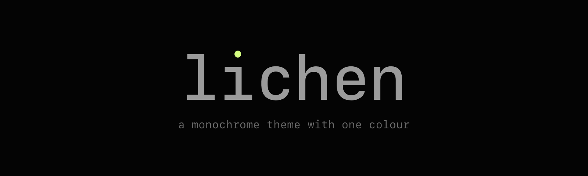
</p>

a monochrome theme with one colour.

neutral greys do all the structural work: eight steps, chroma 0, no warm or cool lean. one lime, `#d4fd80`, is the only hue on screen, and it has one job, being *the* colour. it marks the cursor, the prompt char, the active thing, and function names. nothing else.

with hue off the table, code is told apart by the channels a monochrome theme still has: lightness, weight, slant, and a box. grammar slants (keywords, `this`, decorators), definitions are bold where they are declared, parameters slant so you can see what came in through the door, literals are the brightest grey, and strings sit on a faint box.

errors are a muted red and warnings a muted amber, because those have to mean something. that is the whole hue budget.

<p align="center">
  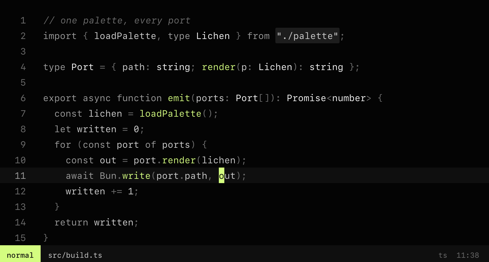
</p>

## palette

<p align="center">
  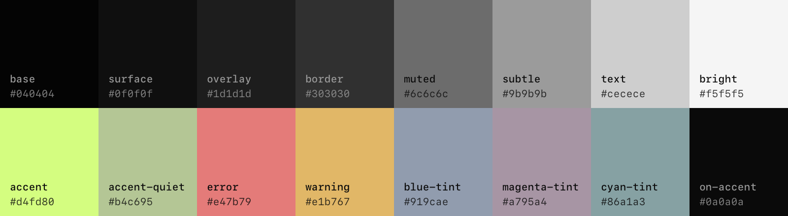
</p>

| role           | hex       | what it is for                                                        |
| -------------- | --------- | --------------------------------------------------------------------- |
| `base`         | `#040404` | the editor and terminal background, the darkest thing on screen       |
| `surface`      | `#0f0f0f` | panels on base: sidebars, statusline, tab bar, cursor line            |
| `overlay`      | `#1d1d1d` | things that float or are chosen: popups, menus, selection, the box behind strings |
| `border`       | `#303030` | lines, not areas: separators, float borders, indent guides            |
| `muted`        | `#6c6c6c` | text that recedes: comments, line numbers, operators, punctuation     |
| `subtle`       | `#9b9b9b` | text that supports: keywords, decorators, builtins, secondary ui      |
| `text`         | `#cecece` | text that carries meaning: identifiers, properties, parameters        |
| `bright`       | `#f5f5f5` | text that is exactly what it says: types, classes, jsx tags, numbers, strings |
| `accent`       | `#d4fd80` | the lime. a point, never an area: cursor, prompt char, function names |
| `accent-quiet` | `#b4c695` | the lime desaturated: diff added, links, git-new                      |
| `error`        | `#e47b79` | errors, diff deleted, failed tests. the loudest colour permitted      |
| `warning`      | `#e1b767` | warnings, diff changed, git modified                                  |

ansi blue, magenta and cyan are tinted greys (chroma 0.03), so terminal programs keep their categories without adding a hue.

everything is defined once, in oklch, in [`palette.json`](palette.json). every port below is generated from it.

## ports

### ghostty

copy [`ports/ghostty/lichen`](ports/ghostty/lichen) to `~/.config/ghostty/themes/lichen`, then:

```
theme = lichen
```

### neovim

the repo root is the plugin. with `vim.pack` (neovim 0.12+):

```lua
vim.pack.add({ { src = "https://github.com/jassuwu/lichen" } })
vim.cmd.colorscheme("lichen")
```

with lazy.nvim:

```lua
{ "jassuwu/lichen", priority = 1000, config = function() vim.cmd.colorscheme("lichen") end }
```

one option, if you want the terminal's background to show through:

```lua
require("lichen").setup({ transparent = true })
```

covers treesitter, lsp semantic tokens, diagnostics, gitsigns, fzf-lua, oil and mini.

### vs code, cursor, t3code

the extension lives in [`ports/vscode`](ports/vscode). it is not on the marketplace; build and sideload it:

```
bun run package
code --install-extension ports/vscode/lichen-0.1.0.vsix     # or cursor --install-extension
```

then pick `lichen` as the colour theme. every workbench key t3code's importer reads is set explicitly.

### herdr

paste [`ports/herdr/lichen.toml`](ports/herdr/lichen.toml) over the `[theme]` section of `~/.config/herdr/config.toml`. it follows the terminal palette and overrides the ui tokens.

### powerlevel10k

replace the colour locals near the top of the lean style in `~/.p10k.zsh` with [`ports/p10k/lichen.zsh`](ports/p10k/lichen.zsh). the prompt char is the lime, directories are `text`, git is `muted`.

## wallpapers

sixteen flavors, all generated from the palette, in 3440×1440 and 3024×1964. the greys do the structure; the lime is the one thing. click through for the full-size file.

<table>
  <tr>
    <td align="center"><a href="ports/wallpaper/lichen-rock-3440x1440.png">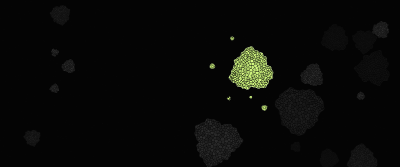</a><br><sub><b>rock</b> — crustose colonies on a rock face</sub></td>
    <td align="center"><a href="ports/wallpaper/lichen-flow-3440x1440.png">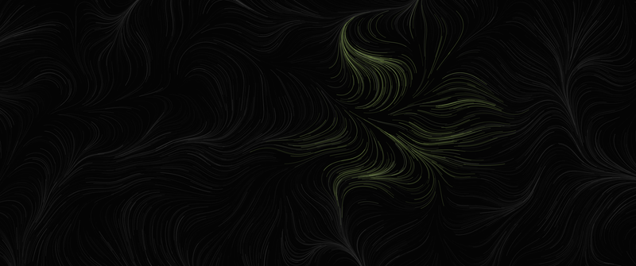</a><br><sub><b>flow</b> — a wind field of grey trails, lime where they cross</sub></td>
  </tr>
  <tr>
    <td align="center"><a href="ports/wallpaper/lichen-attractor-3440x1440.png">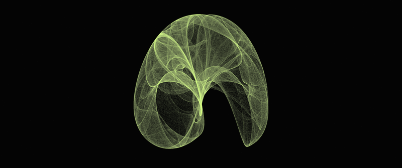</a><br><sub><b>attractor</b> — a de jong attractor, shaded by density</sub></td>
    <td align="center"><a href="ports/wallpaper/lichen-ridge-3440x1440.png">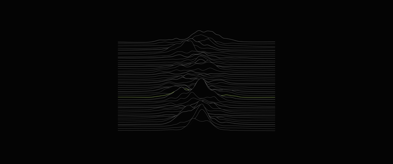</a><br><sub><b>ridge</b> — stacked ridgelines, one contour lime</sub></td>
  </tr>
  <tr>
    <td align="center"><a href="ports/wallpaper/lichen-phyllo-3440x1440.png">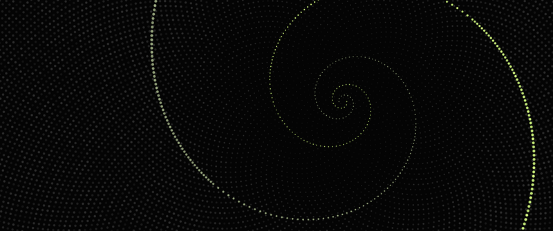</a><br><sub><b>phyllo</b> — phyllotaxis, two golden spirals</sub></td>
    <td align="center"><a href="ports/wallpaper/lichen-dither-3440x1440.png">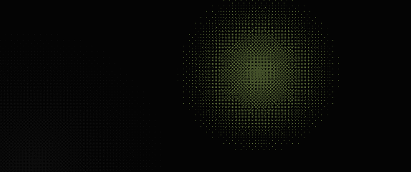</a><br><sub><b>dither</b> — two glows in ordered dither</sub></td>
  </tr>
  <tr>
    <td align="center"><a href="ports/wallpaper/lichen-turing-3440x1440.png">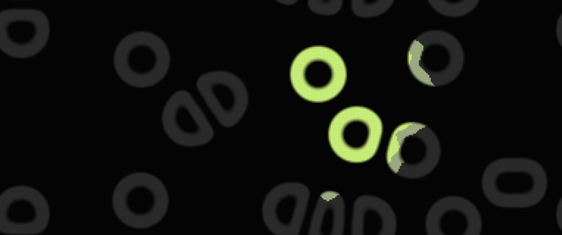</a><br><sub><b>turing</b> — reaction-diffusion, alive in one patch</sub></td>
    <td align="center"><a href="ports/wallpaper/lichen-maze-3440x1440.png">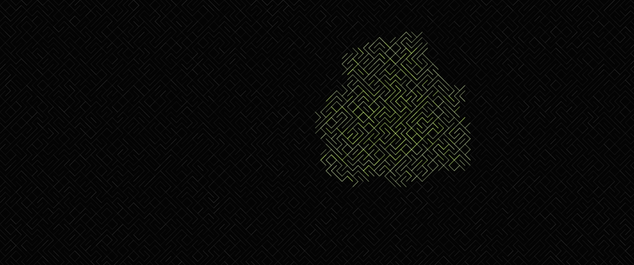</a><br><sub><b>maze</b> — 10 PRINT, overgrown in one spot</sub></td>
  </tr>
  <tr>
    <td align="center"><a href="ports/wallpaper/lichen-branch-3440x1440.png">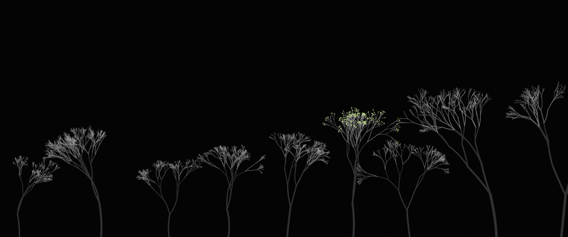</a><br><sub><b>branch</b> — fruticose bushes, one fruiting</sub></td>
    <td align="center"><a href="ports/wallpaper/lichen-rings-3440x1440.png">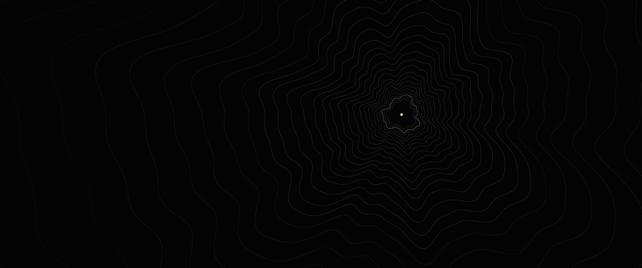</a><br><sub><b>rings</b> — growth margins, read like contours</sub></td>
  </tr>
  <tr>
    <td align="center"><a href="ports/wallpaper/lichen-bands-3440x1440.png">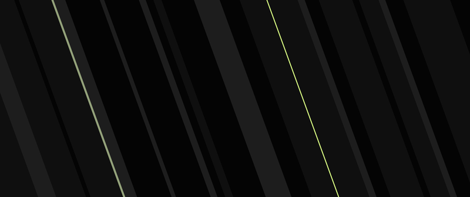</a><br><sub><b>bands</b> — a duotone print</sub></td>
    <td align="center"><a href="ports/wallpaper/lichen-moire-3440x1440.png">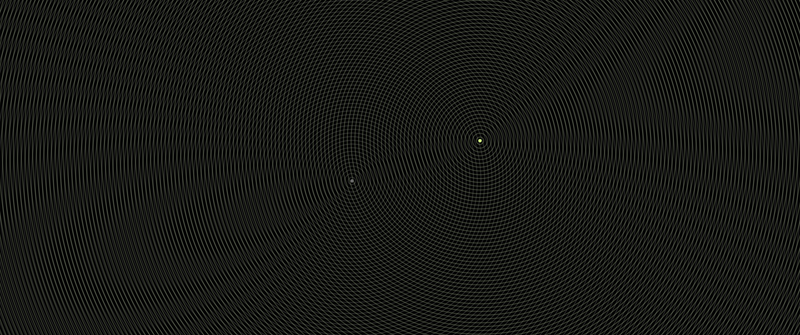</a><br><sub><b>moire</b> — two ring fields beating</sub></td>
  </tr>
  <tr>
    <td align="center"><a href="ports/wallpaper/lichen-tty-3440x1440.png">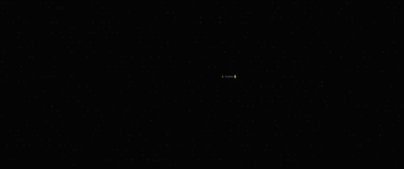</a><br><sub><b>tty</b> — a dim buffer and a live prompt</sub></td>
    <td align="center"><a href="ports/wallpaper/lichen-grid-3440x1440.png">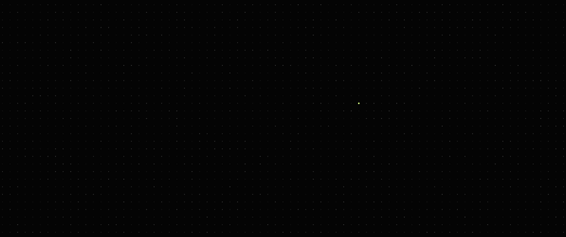</a><br><sub><b>grid</b> — a survey lattice, one live cell</sub></td>
  </tr>
  <tr>
    <td align="center"><a href="ports/wallpaper/lichen-wordmark-3440x1440.png">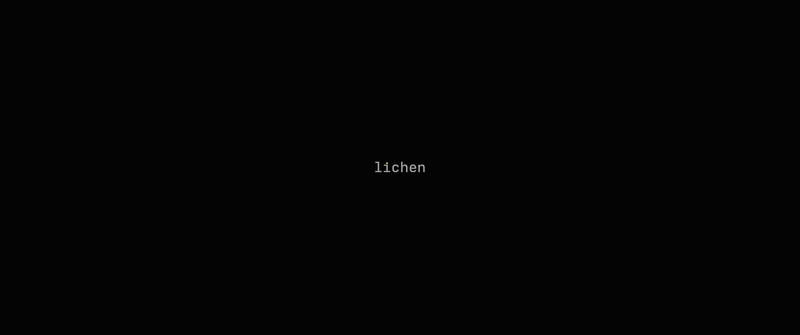</a><br><sub><b>wordmark</b> — the name, tittle in lime</sub></td>
    <td align="center"><a href="ports/wallpaper/lichen-spore-3440x1440.png">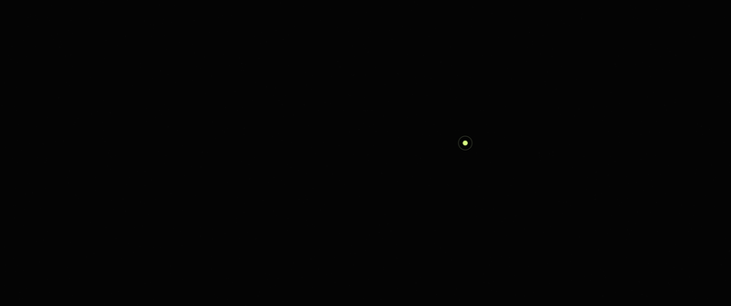</a><br><sub><b>spore</b> — one spore on bare stone</sub></td>
  </tr>
</table>

need another size? add it to `SIZES` in [`src/emit/wallpaper.ts`](src/emit/wallpaper.ts) and run the build.

## build

```
bun install
bun run build     # palette.json → every port, wallpaper and readme asset
bun run check     # fails if a committed port has drifted from the palette
bun test
```

`palette.json` is the source of truth. [`src/palette.ts`](src/palette.ts) turns oklch into hex and checks contrast; each file in [`src/emit/`](src/emit) is one port, a function from the palette to a file. the outputs are committed so every port installs straight from the repo. bun ≥ 1.4, which renders the pictures headlessly with `Bun.WebView`.

## license

mit
